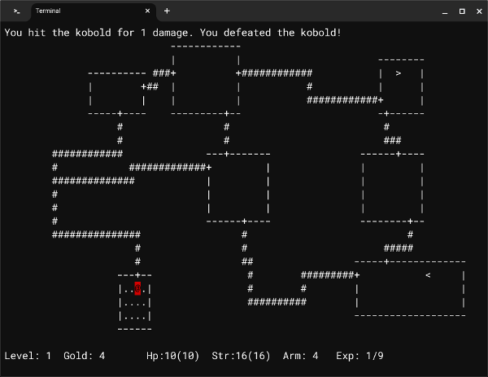

# GoRogue
Back to basics!  A rewrite from scratch of the original game [Rogue](https://en.wikipedia.org/wiki/Rogue_(video_game)) as it was released circa 1980, with a few modern features thrown in, written in Go using [Tcell](https://github.com/gdamore/tcell). The goal is to recreate the playing experience of the original game as much as possible.  



Why?  To teach myself Go, to develop my own framework for future roguelike games, to limit my scope so I actually produce a playable game and, of course, to have a bit of fun.

## Feature Roadmap
```
[X] Basic dungeon map and walking around 
[X] Random level generation 
    [X] Dungeon layout (3X3 Rogue-style)
    [ ] Randomized monsters with "party rooms"
    [ ] Randomized items and treasure
    [ ] Dark rooms
    [ ] Traps
    [ ] Secret doors
[X] Monsters
    [X] All specific basic stats
    [X] Basic states (dormant, chasing player)
    [X] Random movement (e.g. bats or confusion) 
    [X] Chasing the player (pathfinding)
    [ ] Spawning wandering monsters 
[ ] Player
    [ ] Combat (original AD&D rules)
    [X] Awarding XP and leveling up
    [X] Natural healing
    [ ] Hunger
[ ] Items
    [ ] Gold
    [ ] Potions
    [ ] Scrolls
    [ ] Weapons
    [ ] Armor
    [ ] rings
    [ ] Sticks
[ ] Gameplay
    [ ] Title screen
    [ ] End game screen with score 
    [ ] Tracking high scores
    [ ] Amulet of Yendor
```

## Contributing 
Not yet.  Not until I hit version 1.0 but feedback is welcome!
